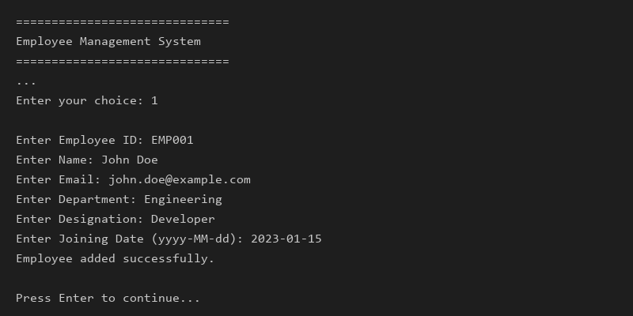
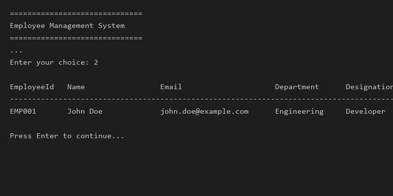
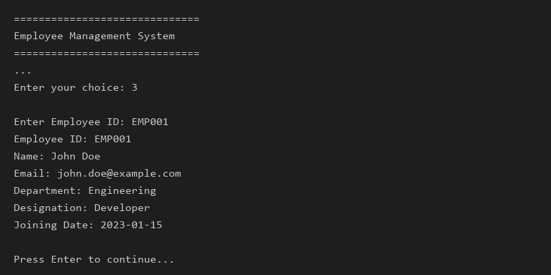
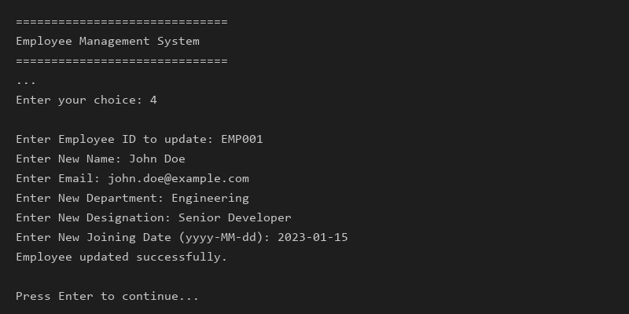
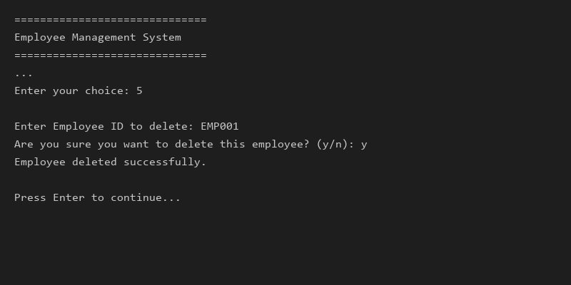
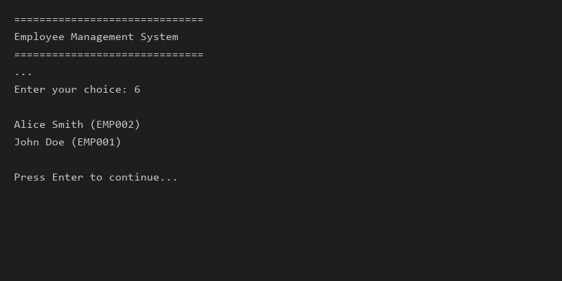
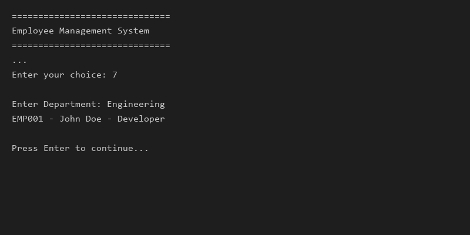

# Employee Management System

This repository contains the Python version of the Employee Management System.

## Run it

```bash
cd python_version
py main.py
```

## Features

- Add employee
- View all employees
- Search employee by ID
- Update employee
- Delete employee
- Sort employees by name
- Filter employees by department

## Technologies Used

- Python 3
- Standard library modules:
  - os
  - json
  - re
  - datetime
  - dataclasses
- VS Code / Windows terminal for running the app

## Screenshots

### 1. Add Employee


### 2. View All Employees


### 3. Search Employee by ID


### 4. Update Employee


### 5. Delete Employee


### 6. Sort Employees by Name


### 7. Filter Employees by Department

